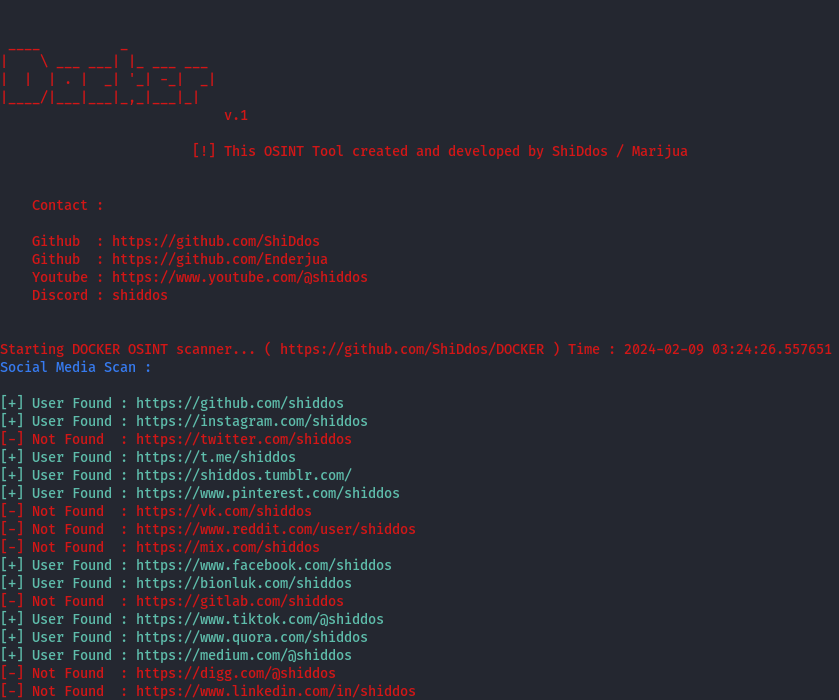

```
 ____          _           
|    \ ___ ___| |_ ___ ___ 
|  |  | . |  _| '_| -_|  _|
|____/|___|___|_,_|___|_|  v.1
```
Docker is a deep osint scanner. All you need is a username to start an Osint scan. With a quick query you will find potential information (country, specific dates, etc...).

<div>
  <p align="center">
     
  </p>
</div>

## Installation

Use the package manager [pip](https://pip.pypa.io/en/stable/) to install foobar.

```bash
git clone https://github.com/ShiDdos/docker
cd docker
pip install -r requirements.txt
python3 docker.py
```
**Write to issues for any bug.**
## Usage

```python
python3 docker.py --u username # start OSINT
python3 docker.py # If you dont want to use parameters like --u . This command Will ask you username and It will start to scan... Good Luck
```
## Contact : 
**Discord : shiddos**

## License
[MIT](https://choosealicense.com/licenses/mit/)  
